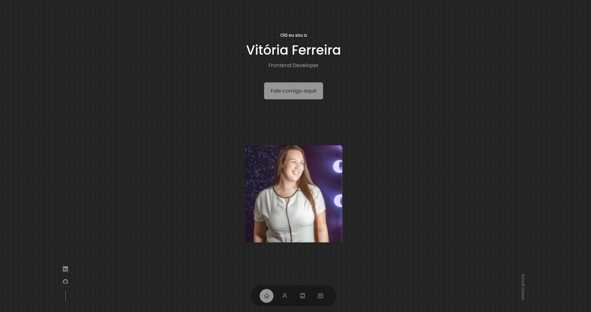

<h1 align="center">
Cap 4 - Falando de hospedagem - Hora do Deploy 
</h1>

Projeto desenvolvido a partir dos módulos estudados do curso Sistema para Internet

  <a href="#-tecnologias">Tecnologias</a>&nbsp;&nbsp;&nbsp;|&nbsp;&nbsp;&nbsp;
  <a href="#-layout">Aplicação</a>&nbsp;&nbsp;&nbsp;|&nbsp;&nbsp;&nbsp;
  <a href="#memo-licença">Licença</a>

  

 

  

## 🚀 Tecnologias

Esse projeto foi desenvolvido com as seguintes tecnologias:

- [ReactJS](https://react.dev/)
- [ViaCEP](https://viacep.com.br/)

## 🔖 Aplicação

Você pode visualizar a aplicação do projeto através [DESSE LINK](https://fiap-cap-04-at-02-5.vercel.app/)

## :memo: Licença

Esse projeto está sob a licença MIT.